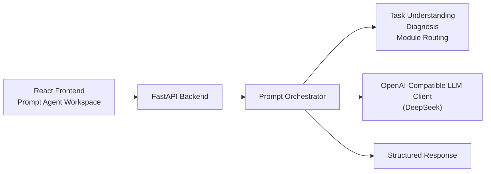

# Better Prompt

Prompt engineering knowledge base and product prototype for building stronger prompts with a practical workflow.

`betterprompt/` is the active app in this repository: a Prompt Agent workspace with a React frontend, a FastAPI backend, and a growing set of product and architecture docs. The rest of the repo contains prompt-writing references, playbooks, and design notes that informed the product direction.

## Why This Repo Exists

- Turn vague prompt ideas into reusable, high-quality prompts.
- Provide a structured workflow for `Generate`, `Debug`, `Evaluate`, and iterative refinement.
- Keep prompt engineering guidance close to a working product, instead of splitting docs and implementation across different repos.

## Highlights

- React + Vite frontend for a workspace-style Prompt Agent UI.
- FastAPI backend with rule-based diagnosis and real LLM-backed `generate`.
- DeepSeek-ready OpenAI-compatible model integration.
- Prompt engineering references, playbooks, and product planning docs in one place.

## Repository Layout

```text
better-prompt/
├── betterprompt/
│   ├── backend/               # FastAPI API, prompt orchestration, LLM integration
│   ├── frontend/              # React + Vite Prompt Agent UI
│   ├── docs/                  # Product docs, milestones, architecture notes
│   └── README.md              # Subproject-specific notes
├── docs/                      # Planning and architecture drafts
├── prompt-*.md                # Prompt engineering references and playbooks
├── howtowritepromptv*.md      # Writing guidance iterations
└── SKILL_README.md            # Skill-oriented repo guidance
```

## Product Snapshot

The current product prototype focuses on one workflow:

1. `Generate`: convert a vague request into a structured prompt.
2. `Debug`: analyze a weak prompt and repair missing control layers.
3. `Evaluate`: score prompt or output quality across multiple dimensions.
4. `Continue`: iterate on the current result with targeted refinement goals.

## Architecture



## Quick Start

### Prerequisites

- Python `3.11+`
- Node.js `18+`
- npm

### 1. Backend Setup

```bash
cd betterprompt/backend
uv venv .venv
.venv/bin/pip install -e .
cp .env.example .env
```

Then edit `.env` and set at least:

```bash
BETTERPROMPT_LLM_API_KEY=your-deepseek-api-key
BETTERPROMPT_LLM_MODEL=deepseek-chat
BETTERPROMPT_LLM_BASE_URL=https://api.deepseek.com
```

Start the API:

```bash
cd betterprompt/backend
.venv/bin/uvicorn app.main:app --host 127.0.0.1 --port 8000
```

The backend now auto-loads `betterprompt/backend/.env`, so `--env-file` is no longer required for normal local development.

### 2. Frontend Setup

```bash
cd betterprompt/frontend
npm install
npm run dev
```

By default the frontend talks to `/api/v1`. During local development, Vite proxies `/api` to `http://127.0.0.1:8000`; when you use `./dev` or `./scripts/betterprompt-dev.sh`, the proxy target follows the backend port selected by the script.

### 3. One-Command Dev Workflow

If you want a single command to bring both services up or down:

```bash
./dev up
./dev down
```

This root shortcut forwards to the full script below:

```bash
./scripts/betterprompt-dev.sh start
./scripts/betterprompt-dev.sh stop
```

The script also supports:

```bash
./dev restart
./dev status
./dev logs
```

Equivalent direct script commands:

```bash
./scripts/betterprompt-dev.sh restart
./scripts/betterprompt-dev.sh status
./scripts/betterprompt-dev.sh logs
```

It starts:

- FastAPI backend on `127.0.0.1:8000`
- Vite frontend on `127.0.0.1:5173`

If `8000` or `5173` is already occupied, the script automatically picks the next available port instead of failing. Runtime logs are written to `betterprompt/.run/logs/`, and the selected ports are recorded in `betterprompt/.run/dev-ports.env`. The script expects backend dependencies, frontend dependencies, and `betterprompt/backend/.env` to be ready first.

### 4. Open the App

- Frontend: [http://127.0.0.1:5173](http://127.0.0.1:5173)
- Backend health: [http://127.0.0.1:8000/api/v1/health](http://127.0.0.1:8000/api/v1/health)
- FastAPI docs: [http://127.0.0.1:8000/docs](http://127.0.0.1:8000/docs)

## Environment Variables

### Backend

- `BETTERPROMPT_LLM_API_KEY`: required
- `BETTERPROMPT_LLM_MODEL`: required
- `BETTERPROMPT_LLM_BASE_URL`: optional, defaults to OpenAI; use `https://api.deepseek.com` for DeepSeek
- `BETTERPROMPT_LLM_ENDPOINT`: optional, defaults to `chat/completions`
- `BETTERPROMPT_LLM_TIMEOUT_SECONDS`: optional, defaults to `120`
- `BETTERPROMPT_LLM_TEMPERATURE`: optional, defaults to `0.3`
- `BETTERPROMPT_ALLOW_TEMPLATE_FALLBACK`: optional, only enable if you want the old local-template behavior when LLM config is missing

## API Overview

Core endpoints:

- `POST /api/v1/prompt-agent/generate`
- `POST /api/v1/prompt-agent/debug`
- `POST /api/v1/prompt-agent/evaluate`
- `POST /api/v1/prompt-agent/continue`
- `GET /api/v1/health`

`generate` now returns which backend produced the result:

- `generation_backend: "llm"` when a real model was used
- `generation_backend: "template"` when explicit fallback is enabled

## Security Notes

- Real secrets belong in `.env`, not `.env.example`.
- `.gitignore` is configured to keep `.env` files out of version control while preserving `*.env.example`.
- If a real API key ever lands in a tracked file or commit history, rotate it immediately.

## Docs Worth Reading

- [Project analysis and frontend fix notes](betterprompt/docs/project-analysis-and-frontend-style-fix.md)
- [Prompt Agent architecture blueprint](docs/plans/betterprompt-product-architecture-blueprint-v1.md)
- [Prompt product frontend spec](docs/plans/prompt-product-frontend-spec.md)
- [Prompt engineering quick reference](prompt-playbook-quick-reference.md)

## Roadmap

- Expand LLM-backed generation into `debug` and `evaluate`.
- Add persistent sessions, iterations, and prompt assets.
- Polish the product into a standalone deployable app.
- Improve documentation, onboarding, and public open-source packaging.

## Contributing

The repo is still evolving quickly, so the easiest way to contribute is:

1. Read the docs in `betterprompt/docs/` and `docs/plans/`.
2. Run the app locally.
3. Open focused PRs that improve either product quality or prompt quality.

## Acknowledgements

This README structure is informed by common GitHub open-source conventions:

- Clear project overview first
- Fast local setup
- Explicit environment configuration
- API and architecture summary
- Security and roadmap sections for collaborators
