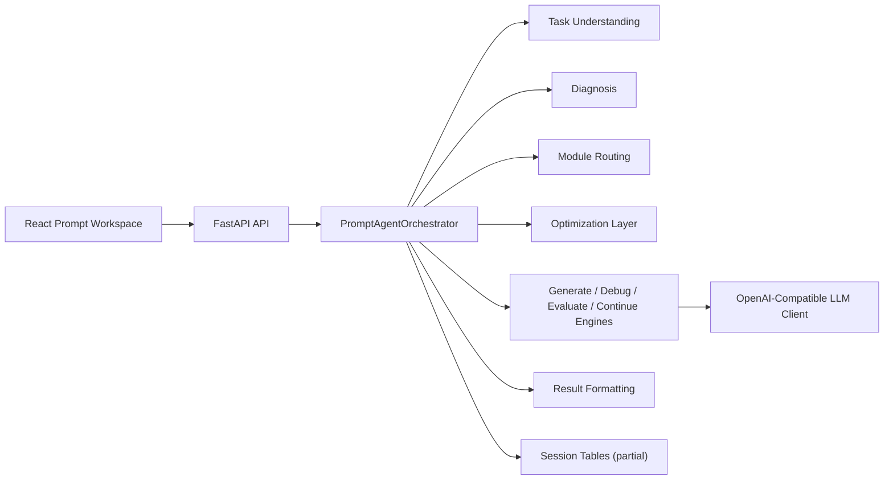

# BetterPrompt 当前项目设计与实现分析

更新日期：2026-03-18

## 1. 分析范围

本次分析基于当前仓库中的以下内容：

- `betterprompt/frontend/`
- `betterprompt/backend/`
- `betterprompt/docs/`
- `docs/plans/`

分析目标不是重复规划文档，而是回答三个更实际的问题：

1. 当前项目到底被实现成了什么。
2. 当前设计和实现在哪些地方已经闭环。
3. 当前设计和实现在哪些地方还停留在“接口先行”或“骨架先行”的阶段。

## 2. 执行摘要

一句话结论：当前 `BetterPrompt` 已经是一个可运行的 Prompt Agent 原型，但它的本质仍然是“结构化工作流 + 规则编排 + 局部 LLM 重写”的产品骨架，而不是一个已经完成资产化、记忆化、历史追踪和工程化收口的成熟平台。

当前状态可以概括为：

- 产品方向是清晰的，围绕 `Generate / Debug / Evaluate / Continue` 四条主流程展开。
- 前端 MVP 已经形成单页工作台，交互主线比早期规划更具体、更可用。
- 后端核心设计是正确的，采用了薄 API + 编排器 + 多引擎的结构化 orchestration。
- 真正闭环的能力主要集中在 `Generate` 与 `Continue`；`Debug` 和 `Evaluate` 仍然以启发式规则为主。
- 数据层和资产层只完成了最小骨架，`session`、`iteration`、`memory`、`history` 还没有真正接入主链路。
- 工程化能力明显不足，仍停留在原型阶段：缺少测试、配置分层、观测、权限、安全边界和正式持久化方案。

## 3. 项目边界与仓库结构

当前仓库并不是一个只有产品代码的纯应用仓库，而是“产品代码 + Prompt 方法论资料 + 产品规划文档”的混合仓库。

其中真正处于活跃应用状态的是 `betterprompt/` 子目录：

- `betterprompt/frontend/`：React + Vite 的 Prompt Agent 工作台。
- `betterprompt/backend/`：FastAPI 后端、规则引擎、LLM 集成和轻量持久化。
- `betterprompt/docs/`：更接近当前子项目的设计记录和阶段分析。

仓库根目录下的 `docs/plans/` 则更多承担蓝图、路线图和目标架构说明的角色。也因此，当前项目最合适的理解方式不是“蓝图已经全部实现”，而是“蓝图已确定方向，代码先落了一个围绕 Prompt Agent 的核心闭环”。

## 4. 当前设计主线

### 4.1 产品设计主线

从 `betterprompt/docs/prompt-agent-architecture.md` 和当前前端实现对照看，项目目前坚持的是一种非常明确的设计选择：

- 不做开放式聊天产品。
- 不做完全自治的 autonomous agent。
- 重点做有模式、有状态、有结构化中间结果的 Prompt 工作台。

也就是说，当前项目更像：

`Prompt Production Workbench`

而不是：

`General-purpose AI Agent`

这条设计主线已经较好地落到了代码里。用户先选模式，再进入相应工作流，最后得到一个可复制的结果；产品强调的是“稳定地产出更强 Prompt”，而不是“让模型自由发挥”。

### 4.2 系统设计主线

当前系统的核心设计可以概括为：

这个结构有两个明显特点：

- API 层非常薄，业务逻辑集中在 orchestrator 和各类 engine 内。
- “中间结构化对象”是整个系统的核心，不是把所有事情都交给一次大模型调用完成。

这与规划文档中提出的 `structured agent orchestration` 基本一致，说明设计方向和实际实现没有跑偏。

## 5. 当前实现拆解

### 5.1 前端实现

前端当前采用：

- React 18
- Vite 5
- TypeScript
- Tailwind CSS 3
- React Router
- TanStack Query

当前前端实现已经不是简单 demo，而是一个明显产品化过的单页工作台：

- `src/app/App.tsx` 与 `src/app/providers.tsx` 负责全局 Provider 装配。
- `src/app/router.tsx` 将 `/` 和 `/prompt-agent` 都路由到 Prompt Agent 页面。
- `src/features/prompt-agent/index.tsx` 负责主页面编排、模式切换、请求状态、结果状态和继续优化状态。
- `src/features/prompt-agent/components/*` 拆分出 `GeneratePanel`、`DebugPanel`、`EvaluatePanel`、`ResultPanel`、`ContinueActions` 等业务组件。
- `src/features/prompt-agent/hooks/*` 中，`debug` 与 `evaluate` 使用 React Query mutation，`generate` 与 `continue` 则手写了 SSE 流式读取逻辑。

这意味着前端已经实现了三层清晰分工：

- 页面级工作流编排
- 模式级输入组件
- 请求级数据获取与流式状态管理

但同时也要看到一个现实问题：当前主页面 `src/features/prompt-agent/index.tsx` 已经承担了过多状态和文案编排职责，后续如果再接入历史记录、会话树、模板、资产详情，页面文件很容易继续膨胀。

### 5.2 后端实现

后端当前采用：

- FastAPI
- Pydantic v2
- SQLAlchemy Async
- SQLite

当前主链路非常清晰：

- `app/main.py` 负责 FastAPI 启动、CORS 和数据库初始化。
- `app/api/v1/prompt_agent.py` 提供 `generate`、`debug`、`evaluate`、`continue` 及其流式接口。
- `app/services/prompt_agent_service.py` 只是薄封装。
- `app/services/prompt_agent/orchestrator.py` 是真正的业务中枢。

后端最值得肯定的地方是没有把所有逻辑直接堆到 route handler 里，而是围绕 orchestrator 做了一次很像样的结构化拆分：

- `TaskUnderstandingEngine`
- `PromptDiagnosisEngine`
- `PromptModuleRouter`
- `PromptOptimizationLayer`
- `PromptGenerateEngine`
- `PromptDebugEngine`
- `PromptEvaluateEngine`
- `PromptContinueEngine`
- `PromptResultFormatter`

这使得当前后端虽然还是单体原型，但代码组织方式已经具备继续演进的条件。

### 5.3 Generate 的实际实现

`Generate` 是当前实现最完整的一条链路。

当前流程是：

1. 根据用户输入做任务识别。
2. 根据任务类型和质量目标推断高风险失败模式。
3. 根据任务类型、失败模式、质量偏好路由控制模块。
4. 生成一份“优化后的任务简报”。
5. 由 `PromptGenerateEngine` 组装最终 prompt 指令。
6. 如果配置了 LLM，则走 OpenAI-compatible 接口生成最终文本。
7. 如果没有配置 LLM 且允许回退，则直接返回模板式 prompt instruction。

这一条链路已经有了明显的产品判断，而不是简单的 prompt 包装：

- 能区分不同任务类型。
- 能区分不同产物类型，如 `task_prompt`、`system_prompt`、`analysis_workflow`、`conversation_prompt`。
- 对文档翻译这类复杂场景写了较强的任务专用规则。
- 支持流式返回和前端增量显示。

所以从实现完成度上看，`Generate` 是当前项目最像“产品核心能力”的部分。

### 5.4 Debug 的实际实现

`Debug` 当前已经有完整接口和 UI，但核心逻辑仍偏启发式模板修复：

- 诊断逻辑主要依赖 prompt/output 中的关键词和长度信号。
- 缺失控制层由规则推断得出。
- 修复结果由 `PromptDebugEngine` 直接把当前 Prompt 包起来，再追加一组修复要求。

这条链路的优点是：

- 成本低。
- 行为稳定。
- 容易解释。

但它也说明当前 `Debug` 还没有真正升级成 LLM 驱动的“面向上下文的 Prompt 修复器”，更多还是一个规则化的修复模板生成器。

### 5.5 Evaluate 的实际实现

`Evaluate` 目前是一个纯规则评分器。

它围绕以下维度进行评分：

- 问题拟合度
- 约束意识
- 信息密度
- 判断强度
- 可执行性
- 自然表达
- 整体稳定性

这个评分器的产品意义是成立的，因为它为“继续优化”和“重构建议”提供了结构化依据；但实现上要非常清楚：

- 当前评分并不是模型级评估。
- 当前评分更接近启发式 rubric 打分。
- 当前结果适合做工作台内的相对反馈，不适合被当成严格客观质量指标。

### 5.6 Continue 的实际实现

`Continue` 是另一个完成度较高的能力。

它的实现方式不是再次跑完整诊断链，而是：

- 基于上一版结果
- 加上本轮优化目标
- 在需要时附加上下文说明
- 直接请求 LLM 重写出新版本

前端还会把 `Debug` 和 `Evaluate` 的结果摘要拼成 `context_notes` 再送给后端，因此它实际上承担了“把一次结果变成多轮工作流”的作用。

这使得当前产品虽然没有做复杂历史树，但已经具备了一个最小可用的多轮打磨闭环。

### 5.7 数据与持久化实现

数据层当前只完成了最小骨架：

- `prompt_sessions`
- `prompt_iterations`
- `users`

但真正接入业务主链路的只有最轻量的 `PromptSessionService`：

- 支持创建 session
- 支持列出 session
- 支持获取 session 详情

而下面这些设计虽然已经出现在 schema 或 model 中，但尚未闭环：

- `Generate/Debug/Evaluate/Continue` 返回中的 `iteration`
- `PromptIteration` 表的写入
- `session_id` 与 `iteration_id` 的真实生成
- `latest_iteration_id` 的更新
- 会话历史与前端工作台联动

因此，当前数据库更多承担“未来产品化方向已经被声明”的作用，而不是“当前系统已经依赖这套持久化”。

## 6. 当前实现与目标蓝图的符合度

| 能力方向 | 当前状态 | 判断 |
| --- | --- | --- |
| 单页工作台 | 已实现 | 与 MVP 前端规格基本一致 |
| Generate/Debug/Evaluate 三模式 | 已实现 | 主流程可用，前端交互完整 |
| Continue Optimization | 已实现 | 已形成最小多轮闭环 |
| 结构化中间对象 | 已实现 | `diagnosis`、`modules`、`score_breakdown` 等均已落地 |
| LLM 可替换接入 | 部分实现 | 当前只有 OpenAI-compatible client，一层抽象已具备 |
| Session/Iteration 持久化 | 部分实现 | schema 和表存在，但主链路未真正写入 |
| Prompt 资产化 | 未实现 | 没有资产域、模板域、详情页和版本树 |
| 历史记录与结果管理 | 未实现 | 前端没有接入 session/history UI |
| 用户体系与权限 | 未实现 | user model 存在，但没有 auth 链路 |
| 观测与工程化 | 未实现 | 缺日志规范、指标、trace、错误分层、测试体系 |

## 7. 当前实现的主要优点

### 7.1 架构方向对

当前项目最重要的优点不是“功能多”，而是“主设计方向是对的”。它没有误入“所有问题都靠一次模型调用解决”的路线，而是把任务理解、诊断、模块路由和最终生成拆成了可演进的部件。

### 7.2 产品主流程已经成立

前端当前已经不是散装页面，而是一个明显围绕用户任务设计的工作台：

- 模式切换清晰
- 输入区和结果区职责明确
- 流式结果反馈直观
- 继续优化动作把结果区变成可持续使用的工作区

这说明产品最关键的使用体验已经具备雏形。

### 7.3 Prompt 领域知识已经进入代码

当前实现并不是“通用 prompt 润色器”，而是已经把具体领域知识写进了任务识别、控制模块和生成要求中，尤其是文档翻译场景的专用规则比较完整。这种“领域知识代码化”是后续形成差异化产品的必要前提。

### 7.4 后续扩展有抓手

因为中间对象和引擎职责已经拆开，后续要做这些事情都比较有抓手：

- 替换任务识别策略
- 引入更强的 debug/evaluate 模型
- 真正接入 session/iteration 持久化
- 把模板、资产、历史等域逐步挂上来

## 8. 关键缺口与风险

### 8.1 接口契约已经提前声明，但实现没有完全跟上

这是当前最值得优先处理的问题之一。

已经声明但未真正闭环的点包括：

- `GeneratePromptRequest.prompt_only` 已进入前后端参数和结果结构，但当前只是在响应中透传，尚未真正改变生成行为。
- `EvaluatePromptRequest.target_type` 已定义为 `prompt` 或 `output`，但当前评估逻辑只消费 `target_text`，没有对不同目标类型采用不同评分策略。
- `DebugPromptRequest.output_preference` 已存在于 schema 中，但当前调试链路没有使用它。
- 所有响应里都声明了 `iteration`，但当前始终是空引用。

这类问题不会立刻让系统不可用，但会持续制造“产品表面上支持，系统内部并未真正支持”的认知落差。

### 8.2 数据模型存在，但业务闭环未形成

当前最典型的“骨架已建、闭环未成”体现在 session/iteration 上：

- `PromptIteration` 表存在，但没有写入逻辑。
- `PromptSession` 只有最小 CRUD，没有和核心生成流程绑定。
- `PromptMemoryService` 已实例化，但没有真正参与 orchestration。
- 前端工作台没有 history/session 视图，刷新页面后状态基本丢失。

这说明产品已经开始朝“资产化 Prompt 平台”设计，但实际上仍然是“单次工作台 + 临时结果”的原型阶段。

### 8.3 Debug 和 Evaluate 的能力仍偏启发式

当前 `Debug` 和 `Evaluate` 的实现非常适合原型期，但如果产品继续往“可信的 Prompt 工具”方向走，现状会逐步成为上限：

- `Debug` 更像结构化修复模板，不是真正上下文敏感的修复器。
- `Evaluate` 更像启发式 rubric 评分，不是真正针对具体任务语境的评估器。
- 任务理解也主要依赖关键词命中，适合早期，但对复杂输入、混合任务和长文本的鲁棒性有限。

### 8.4 工程化能力明显不足

当前后端仍然带有强烈的原型痕迹：

- `DATABASE_URL` 直接写死为本地 SQLite 文件。
- 仓库中直接跟踪了 `betterprompt/backend/betterprompt.db`。
- CORS 是全开放配置。
- 没有 auth、quota、审计、日志规范、trace、指标。
- 没有 Alembic 迁移体系。
- 缺少自动化测试。

这意味着项目目前适合快速迭代和本地试验，但离稳定产品环境还有明显距离。

### 8.5 前端已经可用，但状态与流式逻辑开始变重

前端当前的主要风险不是样式，而是复杂度集中：

- 主页面 `index.tsx` 负责模式状态、多个 draft、多个 mutation、复制反馈、继续优化上下文拼装和结果编排。
- `generate` 与 `continue` 的 SSE 处理逻辑高度相似，但目前是两套手写实现。
- 结果展示已经明显依赖 mode-specific branching，后续再加历史、模板、对比视图会继续增重。

这不是今天必须重构的问题，但已经到了应该提前观察的阶段。

## 9. 建议的下一阶段收口顺序

### 第一优先级：先把“声明过的能力”闭环

建议优先完成以下事项：

- 让 `target_type` 真正进入评估逻辑。
- 让 `output_preference` 真正影响 debug/continue 策略。
- 明确 `prompt_only` 的真实语义，并让后端实现与 UI 文案一致。
- 在主链路中真实生成 `session_id` / `iteration_id` 并落库。

这是最有性价比的一步，因为它不是大改架构，而是先让现有接口契约和产品表达一致。

### 第二优先级：把 session/iteration/history 接入主工作流

建议把当前“临时工作台”升级为“可回看工作台”：

- 每次生成、调试、评估、继续优化都写入 iteration。
- session 持续维护 `latest_iteration_id`。
- 前端增加最小历史侧栏或最近记录入口。
- Continue 默认从 iteration 链路出发，而不是只靠前端内存态传递。

这一层收口完成后，项目才真正开始从“demo”转向“工具产品”。

### 第三优先级：增强规则引擎的可信度

建议逐步升级：

- 任务识别从关键词映射走向更稳的判定策略。
- `Debug` 从模板修复升级到结构化修复 + LLM 判定。
- `Evaluate` 引入任务类型感知和目标类型感知。
- 为关键规则编写单元测试，防止迭代中漂移。

### 第四优先级：补工程化底座

建议补齐：

- 配置中心与环境分层
- 数据库迁移
- 日志与错误分层
- 基础可观测性
- 自动化测试
- 部署边界和安全边界

如果没有这一步，后续功能越多，维护成本会上升得越快。

## 10. 结论

当前 `BetterPrompt` 的真实状态，不应被高估成“完整 Prompt 平台”，也不应被低估成“只有页面的 demo”。

更准确的判断是：

- 它已经完成了一个有明确产品主线的 Prompt Agent 原型。
- 它在前端工作台、后端编排和 `Generate / Continue` 链路上已经形成真实可用的核心体验。
- 它最缺的不是方向，而是把已经声明的产品能力继续收口成真正一致的行为，再把 session、iteration、history 和工程化底座补起来。

如果下一阶段能优先完成“契约闭环 + 数据闭环 + 工程化底座”这三件事，那么当前这套架构完全有机会从原型平滑演进成真正可持续迭代的 Prompt 产品。
